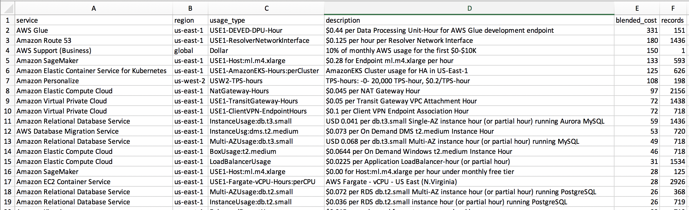
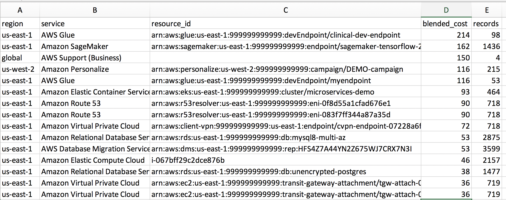

# Amazon Athena SQL Queries

## Partitions

### View Table Partitions

```sql
SELECT *
FROM information_schema.__internal_partitions__
WHERE table_schema = '<DATABASE_NAME>'
        AND table_name = '<TABLE_NAME>'
ORDER BY partition_value
```

## Cost & Usage

### Enabling Cost and Usage Reports for Amazon Athena

Amazon Athena is a serverless Presto environment that you may use to run SQL queries directly on objects in Amazon S3. 

You can use Athena to quickly query and explore your AWS costs, but you must first enable AWS Cost and Usage Reports to export to Amazon S3. 

To enable these reports, navigate to [AWS Cost and Usage Reports Console](https://console.aws.amazon.com/billing/home#/reports) and click **Create report**. 

To learn more about these reports, visit the link below:
https://docs.aws.amazon.com/awsaccountbilling/latest/aboutv2/billing-reports-costusage-files.html

By enabling a cost report and choosing the option to **Enable report data integration for Amazon Athena**, AWS will output cost reports to the S3 bucket of your choice and also create an AWS Glue crawler to periodically crawl the bucket and catalog new reports to a cost table maintained in the Glue catalog. Once the data is catalogued, you can easily query the data using queries like those shown below. 

### Total cost by service and line-item, last 30 days

```sql
SELECT product_region                       AS region,
       product_product_name                 AS service,
       line_item_usage_type                 AS usage_type,
       line_item_line_item_description      AS description,
       round(sum(line_item_blended_cost),0) AS blended_cost,
       count(*)                             AS records
FROM     hourly_cost_for_athena
WHERE    line_item_usage_start_date >= (CURRENT_DATE - interval '30' day)
GROUP BY product_region, 
         product_product_name, 
         line_item_usage_type, 
         line_item_line_item_description
HAVING   round(sum(line_item_blended_cost),0) <> 0
ORDER BY  blended_cost DESC; 
```



### Total cost by resource ID, last 30 days

Want to know how much a specific resource ID (e.g. EC2 instance, EBS volume, load balancer, etc.) is costing you? You can use this report *if* you have enabled resource IDs in your cost report. Note that enabling resource IDs may significantly increase the storage size of your cost reports in S3:

```sql
SELECT CAST(min(line_item_usage_start_date) AS date)    AS start_date,
       CAST(max(line_item_usage_start_date) AS date)    AS end_date,
       product_product_name                 AS service,
       product_region                       AS region,
       line_item_resource_id                AS resource_id,
       round(sum(line_item_blended_cost),0) AS blended_cost,
       count(*)                             AS records
FROM     hourly_cost_for_athena
WHERE    line_item_usage_start_date >= (CURRENT_DATE - interval '3' day)
GROUP BY product_product_name,
         product_region, 
         line_item_resource_id
HAVING   round(sum(line_item_blended_cost),0) <> 0
ORDER BY  blended_cost DESC;
```



### Cost by day, with change from prior day

In the query below, note that: 

* Costs are summarized according to region, service, and day
* `interval '10'` in the first CTE controls how many days we're looking back. 
* The `total_period_cost` represents the total cost of the particular service and region for the `interval` you specified (**not** the current month/year, as is often implied by the term "current period")

```
with detail AS (
  SELECT 
    product_region as region, 
    product_product_name AS aws_service,
    CAST(line_item_usage_start_date AS DATE) AS day,
    round(sum(line_item_blended_cost),2) AS day_cost
  FROM 
    hourly_cost_for_athena
  WHERE 
    line_item_usage_start_date >= (CURRENT_DATE - interval '10' day)
  GROUP BY 
    product_region,
    product_product_name,
    CAST(line_item_usage_start_date AS DATE)
    
),
precomputed AS (
  SELECT 
    region, 
    aws_service,
    day,
    day_cost,
    lag(day_cost,1) OVER (PARTITION BY aws_service, region ORDER BY day desc) AS prior_day_cost,
    round(sum(day_cost) OVER (partition by region, aws_service),2) as total_period_cost
  FROM 
    detail
  GROUP BY  
    region,
    aws_service, 
    day, 
    day_cost
)
SELECT 
  region,
  aws_service,
  day,
  day_cost,
  prior_day_cost,
  round(day_cost - prior_day_cost, 2) AS cost_change,
  total_period_cost
FROM 
  precomputed
WHERE
  day_cost <> 0 and prior_day_cost <> 0
ORDER BY 
  region, 
  aws_service,
  day DESC
```

